# Auto Trading System - Complete Data Flow

## System Architecture Flowchart

```mermaid
graph TD
    %% Configuration and Initialization
    A[User Starts System] --> B[Load Configuration<br/>config/config.yaml]
    B --> C[Initialize Trading Engine<br/>src/core/trading_engine.py]
    C --> D[Initialize Data Manager<br/>src/data/data_manager.py]
    C --> E[Initialize Risk Manager<br/>src/risk/risk_manager.py]
    C --> F[Load Trading Strategies<br/>src/strategies/]
    
    %% Data Flow
    D --> G[Fetch Market Data<br/>Yahoo Finance API]
    G --> H[Data Validation & Cleaning<br/>src/data/data_manager.py]
    H --> I[Calculate Technical Indicators<br/>SMA, RSI, MACD, Bollinger Bands]
    I --> J[Cache Data<br/>data/cache/]
    
    %% Strategy Processing
    F --> K[Strategy Selection<br/>SMA Crossover, RSI, MACD]
    I --> L[Generate Trading Signals<br/>src/strategies/sma_crossover.py]
    L --> M{Signal Type?}
    
    %% Signal Processing
    M -->|Buy Signal| N[Risk Management Check<br/>src/risk/risk_manager.py]
    M -->|Sell Signal| O[Position Check<br/>Check if position exists]
    M -->|Hold| P[Continue Monitoring]
    
    %% Buy Order Flow
    N --> Q{Pass Risk Check?}
    Q -->|Yes| R[Calculate Position Size<br/>Risk-based sizing]
    Q -->|No| P
    R --> S[Execute Buy Order<br/>src/core/trading_engine.py]
    S --> T[Update Portfolio<br/>Cash, Positions]
    T --> U[Record Trade<br/>Trade History]
    
    %% Sell Order Flow
    O --> V{Position Exists?}
    V -->|Yes| W[Execute Sell Order<br/>src/core/trading_engine.py]
    V -->|No| P
    W --> X[Calculate P&L<br/>Profit/Loss]
    X --> Y[Update Portfolio<br/>Cash, Remove Position]
    Y --> U
    
    %% Performance Tracking
    U --> Z[Update Performance Metrics<br/>Portfolio Value, Returns]
    Z --> AA[Calculate Risk Metrics<br/>Drawdown, Volatility, Sharpe Ratio]
    AA --> BB[Update Dashboard Data<br/>Real-time metrics]
    
    %% Dashboard and Monitoring
    BB --> CC[Streamlit Dashboard<br/>dashboard/streamlit_app.py]
    CC --> DD[Display Portfolio Overview<br/>Value, P&L, Positions]
    CC --> EE[Show Performance Charts<br/>Returns, Drawdown]
    CC --> FF[Trade History<br/>Recent trades, Analysis]
    CC --> GG[Risk Metrics<br/>Gauges, Alerts]
    
    %% Logging and Storage
    U --> HH[Log Trade<br/>logs/trading.log]
    Z --> II[Store Performance Data<br/>data/backtest_results.csv]
    AA --> JJ[Update Database<br/>SQLite - data/trading.db]
    
    %% Control Flow
    GG --> KK{Continue Trading?}
    KK -->|Yes| G
    KK -->|No| LL[Stop Trading<br/>Close Positions]
    
    %% Backtesting Mode
    A --> MM[Backtest Mode?]
    MM -->|Yes| NN[Load Historical Data<br/>Date Range]
    NN --> G
    MM -->|No| C
    
    %% Live Trading Mode
    A --> OO[Live Trading Mode?]
    OO -->|Yes| PP[Connect to Broker API<br/>Alpaca, Interactive Brokers]
    PP --> G
    OO -->|No| C
    
    %% Error Handling
    G --> QQ{Data Fetch Error?}
    QQ -->|Yes| RR[Use Cached Data<br/>data/cache/]
    QQ -->|No| H
    
    N --> SS{Risk Limit Exceeded?}
    SS -->|Yes| TT[Reduce Position Size<br/>or Skip Trade]
    SS -->|No| R
    
    %% Performance Alerts
    AA --> UU{Performance Alert?}
    UU -->|Yes| VV[Send Alert<br/>Email, SMS, Dashboard]
    UU -->|No| BB
    
    %% Styling
    classDef configClass fill:#e1f5fe
    classDef dataClass fill:#f3e5f5
    classDef strategyClass fill:#e8f5e8
    classDef riskClass fill:#fff3e0
    classDef executionClass fill:#fce4ec
    classDef performanceClass fill:#f1f8e9
    classDef dashboardClass fill:#e0f2f1
    classDef storageClass fill:#fafafa
    
    class A,B configClass
    class G,H,I,J,NN dataClass
    class K,L,M strategyClass
    class N,Q,R,SS,TT riskClass
    class S,T,U,V,W,X,Y executionClass
    class Z,AA,UU,VV performanceClass
    class CC,DD,EE,FF,GG dashboardClass
    class HH,II,JJ,RR storageClass
```



## Detailed File Flow

### 1. **Configuration & Initialization**
```
User Input → config/config.yaml → src/utils/config_manager.py
                                    ↓
                            src/core/trading_engine.py
                                    ↓
                    ┌─────────────────┬─────────────────┐
                    ↓                 ↓                 ↓
        src/data/data_manager.py  src/risk/risk_manager.py  src/strategies/
```

### 2. **Data Pipeline**
```
Yahoo Finance API → src/data/data_manager.py
                           ↓
                   Data Validation & Cleaning
                           ↓
              Calculate Technical Indicators
                           ↓
                    Cache to data/cache/
                           ↓
              Return DataFrame with Indicators
```

### 3. **Strategy Processing**
```
src/strategies/base_strategy.py (Abstract Base)
                    ↓
src/strategies/sma_crossover.py
                    ↓
Generate Signals (Buy/Sell/Hold)
                    ↓
Return Signal Dictionary
```

### 4. **Risk Management**
```
src/risk/risk_manager.py
    ├── Position Size Calculation
    ├── Portfolio Risk Check
    ├── Stop Loss Validation
    ├── Take Profit Check
    └── Drawdown Monitoring
```

### 5. **Order Execution**
```
src/core/trading_engine.py
    ├── _execute_buy_order()
    ├── _execute_sell_order()
    ├── Update Portfolio State
    ├── Record Trade History
    └── Update Performance Metrics
```

### 6. **Performance Tracking**
```
Performance Metrics Calculation:
├── Total Return
├── Sharpe Ratio
├── Maximum Drawdown
├── Volatility
├── Win Rate
└── Trade Statistics
```

### 7. **Dashboard & Monitoring**
```
dashboard/streamlit_app.py
    ├── Portfolio Overview Tab
    ├── Performance Analysis Tab
    ├── Positions Management Tab
    ├── Trade History Tab
    └── Real-time Updates
```

### 8. **Data Storage & Logging**
```
Storage Locations:
├── logs/trading.log (Trade logs)
├── data/backtest_results.csv (Performance data)
├── data/cache/ (Market data cache)
└── data/trading.db (SQLite database)
```

## Key Data Transformations

### Market Data Flow
```
Raw API Data → Cleaned DataFrame → Technical Indicators → Signal Generation
     ↓              ↓                      ↓                    ↓
Yahoo Finance   Remove NaN         SMA, RSI, MACD        Buy/Sell/Hold
     ↓              ↓                      ↓                    ↓
JSON Response   Forward Fill       Bollinger Bands       Strategy Output
```

### Portfolio State Updates
```
Initial State → Trade Execution → Position Update → Performance Recalculation
     ↓              ↓                ↓                    ↓
$100,000 Cash   Buy 100 AAPL    +100 AAPL @ $150    Portfolio Value Update
     ↓              ↓                ↓                    ↓
No Positions    -$15,000 Cash   -$15,000 Cash       $115,000 Total Value
```

### Risk Management Flow
```
Signal Generated → Risk Check → Position Sizing → Order Execution
      ↓              ↓            ↓                ↓
Buy AAPL        Max Position    $10,000 Limit    Execute Trade
      ↓              ↓            ↓                ↓
Strategy Output  Risk Rules     Risk Manager     Trading Engine
```

## Error Handling & Recovery

### Data Fetching Errors
```
API Failure → Use Cached Data → Log Error → Continue Trading
     ↓              ↓              ↓            ↓
Network Issue   Last Known Data  Error Log    System Stability
```

### Risk Limit Violations
```
Risk Check Failed → Reduce Position Size → Re-check → Execute or Skip
      ↓                ↓                    ↓          ↓
Portfolio Risk    Smaller Trade Size    Risk OK?    Trade Decision
```

### Performance Alerts
```
Performance Alert → Dashboard Warning → User Notification → Action Required
      ↓                ↓                    ↓                ↓
Drawdown > 20%    Visual Alert        Email/SMS        Stop Trading
```

## Real-time vs Batch Processing

### Real-time (Live Trading)
```
Market Data → Signal → Risk Check → Execute → Update → Dashboard
     ↓         ↓         ↓          ↓         ↓         ↓
Every Tick   Instant   Immediate   Real-time  Live     Real-time
```

### Batch (Backtesting)
```
Historical Data → Process All → Calculate Metrics → Generate Report
      ↓              ↓              ↓                ↓
Date Range      All Signals     Performance       CSV Output
```

This flowchart shows the complete end-to-end data flow of the auto trading system, from initial configuration through data processing, signal generation, order execution, and performance tracking. 