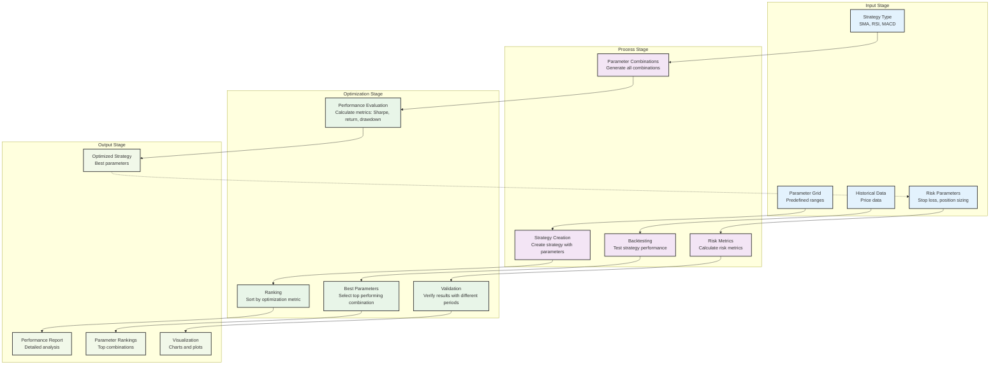
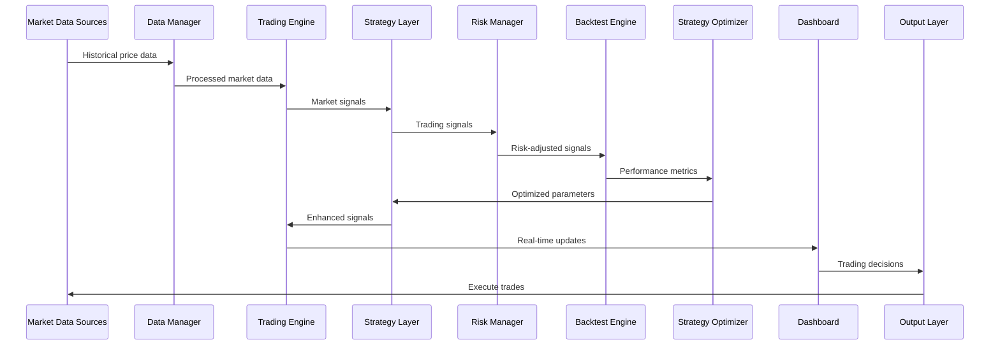

# Auto Trading System Flowchart Documentation

## 📊 System Architecture Overview

The Auto Trading System is a comprehensive platform designed for algorithmic trading with risk management, backtesting, and optimization capabilities. This document provides a detailed flowchart of the system's architecture and data flow.

## 🏗️ System Architecture Flowchart

```mermaid
graph TB
    %% Data Layer
    subgraph "Data Layer"
        MD[Market Data<br/>Yahoo Finance, VNStock]
        HC[Historical Data Cache]
        RT[Real-time Price Feeds]
        CF[Configuration Files]
    end
    
    %% Core Layer
    subgraph "Core Layer"
        DM[Data Manager<br/>Data fetching, caching, validation]
        TE[Trading Engine<br/>Order execution, portfolio management]
        CM[Configuration Manager<br/>Settings, parameters]
        LM[Logging & Monitoring<br/>Performance tracking]
    end
    
    %% Strategy Layer
    subgraph "Strategy Layer"
        SMA[SMA Crossover Strategy]
        RSI[RSI Strategy]
        MACD[MACD Strategy]
        CS[Custom Strategies]
    end
    
    %% Technical Indicators
    subgraph "Technical Indicators"
        SMA_I[SMA<br/>Simple Moving Average]
        RSI_I[RSI<br/>Relative Strength Index]
        MACD_I[MACD<br/>Moving Average Convergence]
        BB[Bollinger Bands]
    end
    
    %% Risk Management Layer
    subgraph "Risk Management Layer"
        PS[Position Sizing<br/>Risk-based allocation]
        SL[Stop Loss & Take Profit<br/>Automatic execution]
        PRL[Portfolio Risk Limits<br/>Maximum exposure]
        DM_R[Drawdown Monitoring<br/>Real-time tracking]
    end
    
    %% Backtesting Layer
    subgraph "Backtesting Layer"
        BE[Backtest Engine<br/>Multi-strategy testing]
        PM[Performance Metrics<br/>Sharpe, drawdown, win rate]
        TT[Trade Tracking<br/>Complete history, analysis]
        RI[Risk Integration<br/>Risk metrics in backtesting]
    end
    
    %% Optimization Layer
    subgraph "Optimization Layer"
        PG[Parameter Grid<br/>Strategy parameter combinations]
        SO[Strategy Optimizer<br/>Risk-based optimization]
        PP[Parallel Processing<br/>Efficient multi-core execution]
        RA[Results Analysis<br/>Top parameters, reports]
    end
    
    %% Dashboard Layer
    subgraph "Dashboard Layer"
        WD[Web Dashboard<br/>Streamlit-based monitoring]
        TC[Trading Charts<br/>Interactive OHLC charts]
        PR[Performance Reports<br/>Detailed analysis]
        RTM[Real-time Monitoring<br/>Live updates]
    end
    
    %% Output Layer
    subgraph "Output Layer"
        OS[Optimized Strategies<br/>Best parameters]
        BR[Backtest Results<br/>Performance data]
        RR[Risk Reports<br/>Risk metrics, alerts]
        TS[Trading Signals<br/>Buy/sell decisions]
    end
    
    %% Data Flow Connections
    MD --> DM
    HC --> DM
    RT --> TE
    CF --> CM
    
    DM --> SMA
    TE --> RSI
    CM --> MACD
    LM --> CS
    
    SMA --> SMA_I
    RSI --> RSI_I
    MACD --> MACD_I
    CS --> BB
    
    SMA --> PS
    RSI --> SL
    MACD --> PRL
    CS --> DM_R
    
    PS --> BE
    SL --> PM
    PRL --> TT
    DM_R --> RI
    
    SMA --> PG
    RSI --> SO
    MACD --> PP
    CS --> RA
    
    BE --> WD
    PM --> TC
    TT --> PR
    RI --> RTM
    
    PG --> PR
    SO --> RTM
    
    WD --> OS
    TC --> BR
    PR --> RR
    RTM --> TS
    
    %% Styling
    classDef dataLayer fill:#E3F2FD,stroke:#333,stroke-width:2px
    classDef coreLayer fill:#F3E5F5,stroke:#333,stroke-width:2px
    classDef strategyLayer fill:#E8F5E8,stroke:#333,stroke-width:2px
    classDef riskLayer fill:#FFF3E0,stroke:#333,stroke-width:2px
    classDef backtestLayer fill:#FCE4EC,stroke:#333,stroke-width:2px
    classDef optimizationLayer fill:#F1F8E9,stroke:#333,stroke-width:2px
    classDef dashboardLayer fill:#E0F2F1,stroke:#333,stroke-width:2px
    classDef outputLayer fill:#F9FBE7,stroke:#333,stroke-width:2px
    
    class MD,HC,RT,CF dataLayer
    class DM,TE,CM,LM coreLayer
    class SMA,RSI,MACD,CS strategyLayer
    class PS,SL,PRL,DM_R riskLayer
    class BE,PM,TT,RI backtestLayer
    class PG,SO,PP,RA optimizationLayer
    class WD,TC,PR,RTM dashboardLayer
    class OS,BR,RR,TS outputLayer
```

## 🔄 Optimization Flowchart

## 📈 Data Flow Diagram

## 🎯 Component Details

### Data Layer
- **Market Data**: Fetches data from Yahoo Finance and VNStock APIs
- **Historical Cache**: Stores processed historical data for quick access
- **Real-time Feeds**: Live price updates for real-time trading
- **Configuration Files**: System settings and parameters

### Core Layer
- **Data Manager**: Handles data fetching, validation, and caching
- **Trading Engine**: Executes orders and manages portfolio
- **Configuration Manager**: Manages system settings and parameters
- **Logging & Monitoring**: Tracks system performance and errors

### Strategy Layer
- **SMA Crossover**: Simple Moving Average crossover strategy
- **RSI Strategy**: Relative Strength Index-based strategy
- **MACD Strategy**: Moving Average Convergence Divergence strategy
- **Custom Strategies**: User-defined trading strategies

### Risk Management Layer
- **Position Sizing**: Calculates position sizes based on risk
- **Stop Loss & Take Profit**: Automatic order execution
- **Portfolio Risk Limits**: Maximum exposure controls
- **Drawdown Monitoring**: Real-time drawdown tracking

### Backtesting Layer
- **Backtest Engine**: Tests strategies on historical data
- **Performance Metrics**: Calculates Sharpe ratio, drawdown, win rate
- **Trade Tracking**: Records complete trade history
- **Risk Integration**: Incorporates risk metrics in backtesting

### Optimization Layer
- **Parameter Grid**: Generates parameter combinations
- **Strategy Optimizer**: Finds optimal parameters
- **Parallel Processing**: Multi-core optimization
- **Results Analysis**: Analyzes optimization results

### Dashboard Layer
- **Web Dashboard**: Streamlit-based monitoring interface
- **Trading Charts**: Interactive OHLC charts
- **Performance Reports**: Detailed analysis reports
- **Real-time Monitoring**: Live system monitoring

### Output Layer
- **Optimized Strategies**: Best parameter combinations
- **Backtest Results**: Performance data and statistics
- **Risk Reports**: Risk metrics and alerts
- **Trading Signals**: Buy/sell decision signals

## 🔧 System Integration

### Data Flow Process
1. **Data Ingestion**: Market data is fetched from multiple sources
2. **Data Processing**: Raw data is cleaned and validated
3. **Strategy Execution**: Trading strategies generate signals
4. **Risk Assessment**: Risk manager evaluates and adjusts signals
5. **Backtesting**: Historical performance is evaluated
6. **Optimization**: Parameters are optimized for better performance
7. **Real-time Trading**: Optimized strategies execute live trades
8. **Monitoring**: Dashboard provides real-time system status

### Key Features
- **Modular Architecture**: Each component operates independently
- **Risk Management**: Comprehensive risk controls at every level
- **Backtesting Engine**: Historical performance evaluation
- **Strategy Optimization**: Parameter optimization for better returns
- **Real-time Monitoring**: Live system status and performance
- **Interactive Dashboard**: User-friendly monitoring interface

## 📊 Performance Metrics

### Trading Metrics
- **Total Return**: Overall strategy performance
- **Sharpe Ratio**: Risk-adjusted returns
- **Maximum Drawdown**: Largest peak-to-trough decline
- **Win Rate**: Percentage of profitable trades
- **Profit Factor**: Ratio of gross profit to gross loss

### Risk Metrics
- **Value at Risk (VaR)**: Potential loss at confidence level
- **Expected Shortfall**: Average loss beyond VaR
- **Volatility**: Standard deviation of returns
- **Beta**: Market correlation measure

### System Metrics
- **Execution Speed**: Order execution latency
- **Data Quality**: Accuracy and completeness of market data
- **System Uptime**: Availability percentage
- **Error Rate**: System error frequency

## 🚀 Usage Instructions

### Running the System
1. **Install Dependencies**: `pip install -r requirements.txt`
2. **Configure Settings**: Update `config/config.yaml`
3. **Run Backtesting**: `python run_backtest.py`
4. **Run Optimization**: `python run_optimization.py`
5. **Launch Dashboard**: `python run_dashboard.py`

### Configuration
- **Trading Parameters**: Set in `config/trading.yaml`
- **Risk Parameters**: Configure in `config/risk.yaml`
- **Strategy Parameters**: Define in `config/strategies.yaml`
- **Data Sources**: Specify in `config/data.yaml`

## 📝 Notes

- The system supports multiple data sources and trading strategies
- Risk management is integrated at every level
- Backtesting provides historical performance validation
- Optimization improves strategy parameters automatically
- Real-time monitoring ensures system reliability
- The modular design allows easy extension and customization

---

*This flowchart documentation provides a comprehensive overview of the Auto Trading System architecture, data flow, and component interactions.* 